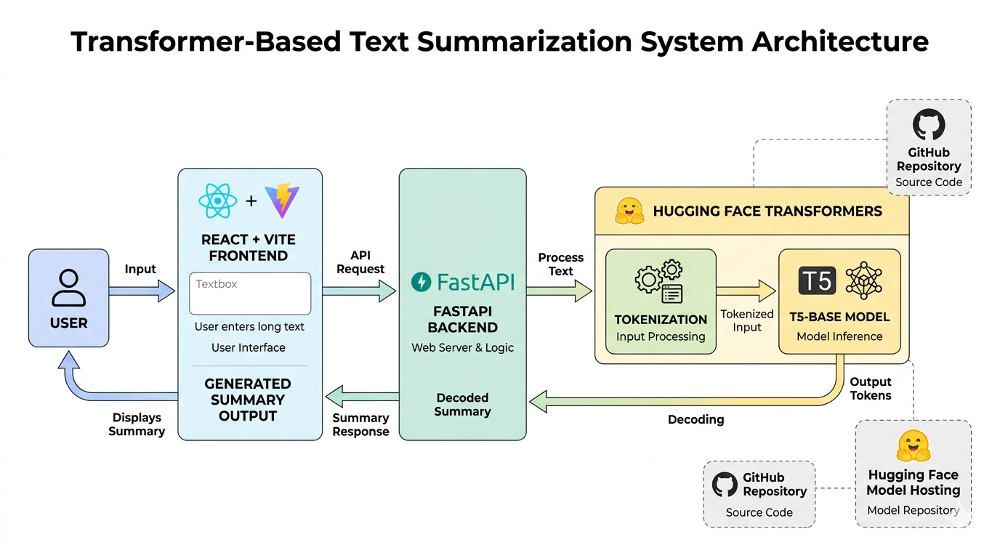

# SummarizeAI 🚀

SummarizeAI is a Transformer-based text summarization application that converts long paragraphs, articles, and conversations into concise and meaningful summaries using the T5 Transformer model.

Built using FastAPI, React + Vite, and Hugging Face Transformers.

---

## Features

- Generate summaries from long text instantly
- Transformer-based NLP pipeline using T5
- FastAPI backend for inference
- React frontend for user interaction
- Hugging Face hosted model integration

---

## Tech Stack

### Frontend
- React
- Vite

### Backend
- FastAPI
- Python

### Machine Learning / NLP
- T5-base Transformer
- Hugging Face Transformers
- PyTorch

---

## How It Works

1. User enters long text in the frontend  
2. Frontend sends request to FastAPI backend  
3. Backend tokenizes the input text  
4. T5 Transformer generates summary tokens  
5. Tokens are decoded into meaningful text  
6. Summary is returned to frontend  

---

## System Architecture



---

## Demo


---

## Challenges Faced

While building this project, I faced several real-world ML engineering challenges:

- Large model file size (~850MB)
- GitHub rejecting large model weights
- Deployment memory limitations on Render free tier
- Managing Hugging Face model hosting
- Backend integration and inference handling

This project helped me understand that training a model and deploying it efficiently are two very different problems.

---

## Model Information

- Model: T5-base
- Task: Text Summarization

### Hugging Face Model

https://huggingface.co/AdityaKarande/summarize-ai-model

---

## Project Structure

```bash
backend/
frontend/
upload_model.py
README.md
```

---

## Setup Instructions

### Clone Repository

```bash
git clone https://github.com/Aditya-Karande/summarize-ai.git
```

### Backend Setup

```bash
cd backend

python -m venv summarizer_env

summarizer_env\Scripts\activate

pip install -r requirements.txt

uvicorn main:app --reload
```

### Frontend Setup

```bash
cd frontend

npm install

npm run dev
```

---

## Future Improvements

- Model optimization for deployment
- Better inference efficiency
- Improved deployment infrastructure
- Better UI/UX

---

## Author

Aditya Karande
